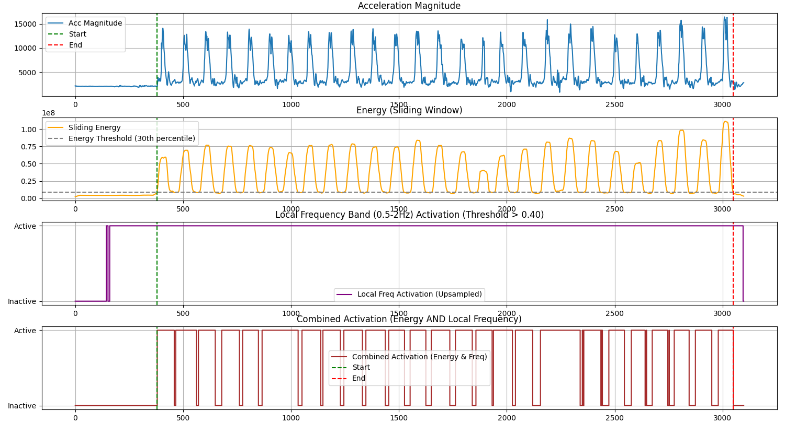
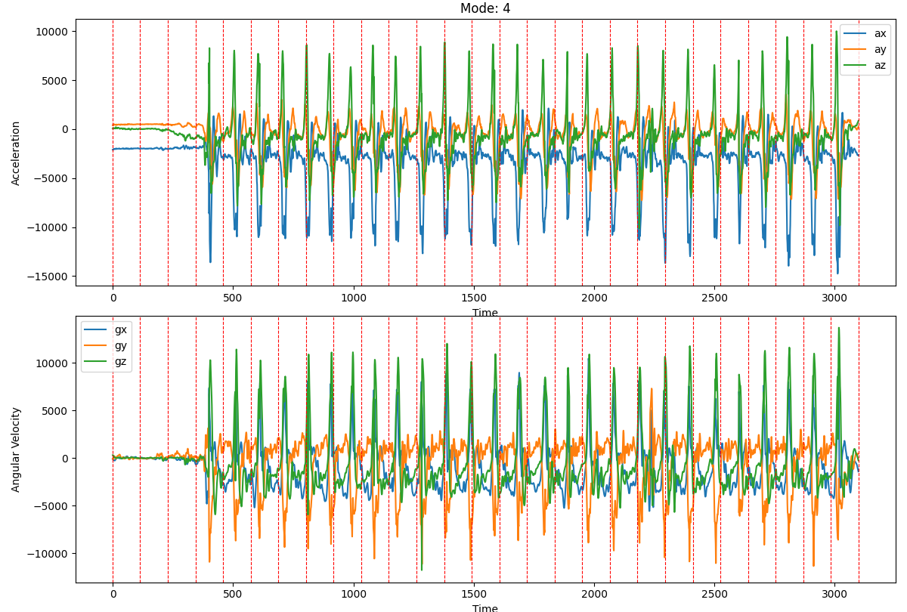
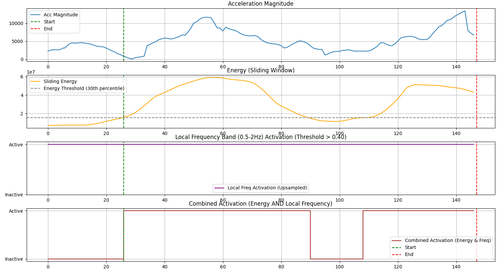

# AI CUP 2025

反正試過什麼方法或是有什麼發現都寫上來

## 嘗試過的方法

- 使用 random forest 預測持拍手，透過技巧單獨測量，在官方 public leader 已可達 0.996

## 一些酷發現

1. 部分訓練集揮拍數據的起始及末尾會有不動的數據

   
   

2. 部分訓練集揮拍數據長處異常的短或異常的長

   

3. 官方提供的 cut point 不準（僅供參考）

   解決方案：提供 `cut.py` 將資料進行切割，切出來的部分較為精準
